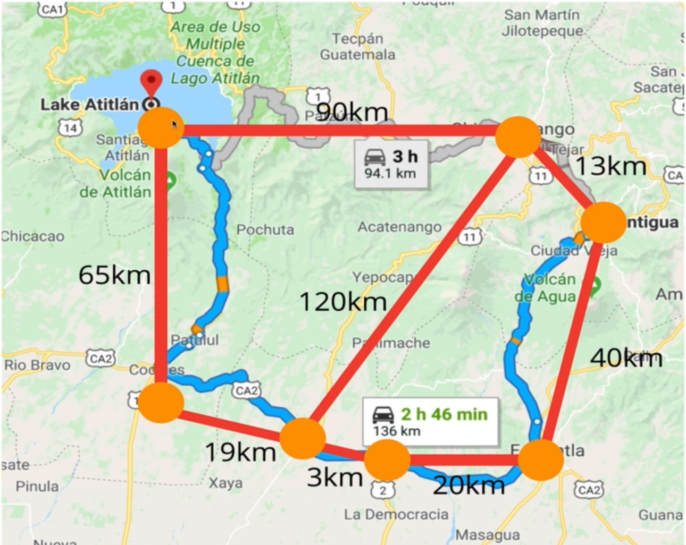
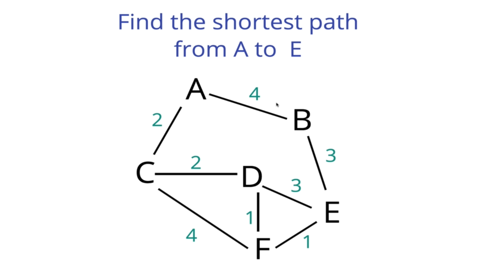
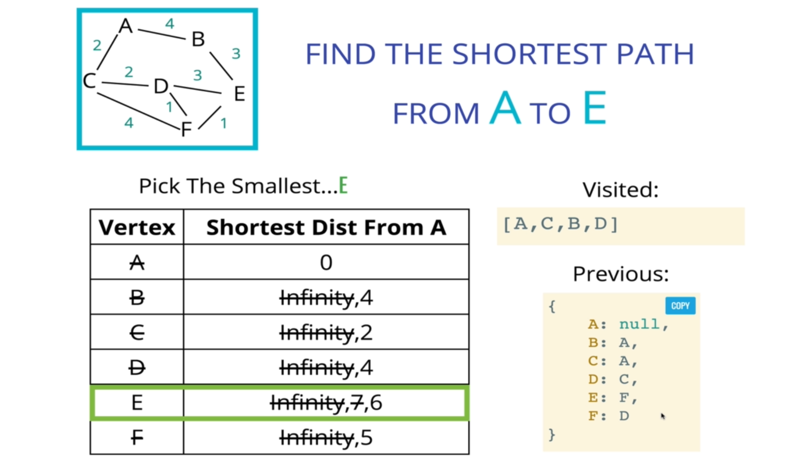

# Dijkstra's Algorithm

Dijkstra's algorithm (DA) is a very famous algorithm that helps find the shortest path between two nodes.  It is built upon two other data structures to be implemented - graphs and priority queues.  It works upon a weighted graph, and it uses a priority queue to help figure out what the shortest distance between K nodes are.

## History

It is one of the most famous and widely used algorithms around.  It was invented by Edsger Dijkstra, a Dutch programmer, physicist, essayist, and all around smart guy.  He helped to advance the field of computer science from an "art" to an academic discipline.  Many of his discoveries and algorithms are still commonly used to this day.  The impetus for him coming up with DA was that he wanted a problem to demonstrate why computers were important to humans.  He deigned it in twenty minutes at a cafe table after travelling from Rotterdam to Groningen and thinking of the shortest way to travel it.

(DA) is short for Dijkstra's Shortest Path Algorithm.  It is used everywhere in programming, and often the large tech companies have this algorithm implemented into their features that they consider their "secret sauce".  It is very popular and very powerful.

### What does it do?

It finds the shortest path between two vertices on a graph.  It answers the question: "What's the fastest way to get from point A to point B?".

### WHy is it useful?

- GPS - finding fastest route
- Network Routing - finds open shortest path for data
- Biology - used to model the spread of viruses among humans
- Airline tickets - finding chepest route to your destination

We can take the algorithm and tweak it to account for whatever data we're working with.  It can be applied in many different areas.



## Implementation

We will implemente DA by using a weighted graph and a priority queue.

Check out our weighted graph at `/data-structures/WeighedGraph.js`.  It works with the below problem:



### Algorithm Main Steps

1. Every time we look to visit a new node, pick the node with the smallest known distance to visit first.
2. Once we've moved to the node we're going to visit, we look at each of its neighbors.
3. For each neighboring node, we calculate the distance by summing the total edges that lead to the node we're checking _from the starting node_.
4. If the new total distance to a node is less than the previous total, we store the new shorter distance for that node.



### Priority Queue

Where does a priority queue come into play?  Well, when we are looking at what the next node to visit should be based off smallest value from X is in our table, our priority queue will tell us that.  It will give us the next node to visit.

**Simple Priority Queue** - an array.  When we insert in a new node, we add a priority to it as well.  Then we sort the array based on the priority.  Then when we pull from the queue, we will automatically be pulling the highest priority / lowest value.  Notice we are sorting which is `O(n*logn)` time.

```js
class SimplePriorityQueue {
 constructor() {
  this.values = []
 }
 enqueue(val, priority) {
  this.values.push({ val, priority })
  this.sort()
 }
 dequeue() {
  return this.values.shift()
 }
 sort() {
  this.values.sort((a, b) => a.priority - b.priority)
 }
}
```

### Dijkstra's Pseudocode

- The function should accept a starting and ending vertex.
- Create an object (we'll call it `distances`), and set each key to be every vertex in the adjacency list with a value of `Infinity`, except for the starting vertext which should have a value of 0.
- After setting a value in the `distances` object, add each vertex with a priority of `Infinity` to the priority queue, except the starting vertex, which should have a priority of 0 because that's where we begin.
- Create another object called `previous`, and set each key to be every vertex in the adjacency list with a value of null.
- Start looping as long as there is anything in the priority queue.
  - `Dequeue` a vertex from the priority queue
  - If that vertex is the same as the ending vertex - we are done!
  - Otherwise, loop through each value in the adjacency list at that vertex
    - Calculate the distance to that vertex from the starting vertex by summing the edge weights together
    - If the distance is less than what is currently stored in our `distances` object
      - Update the `distances` object with new lower distance
      - Update the `previous` object to contain that vertex
      - `Enqueue` the vertex with the total distance from the start node
- Return a list/array of the nodes and in what order to visit that represents the shortest path
