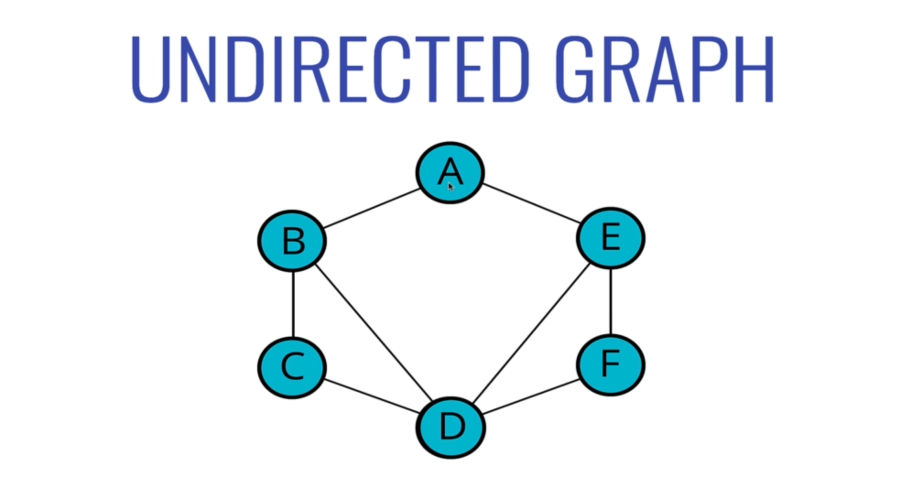
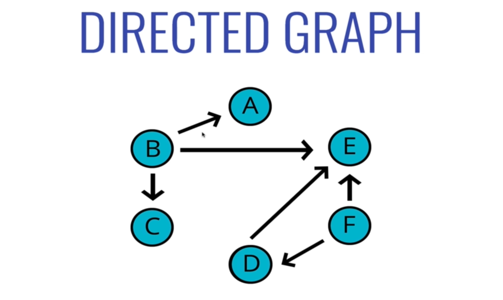
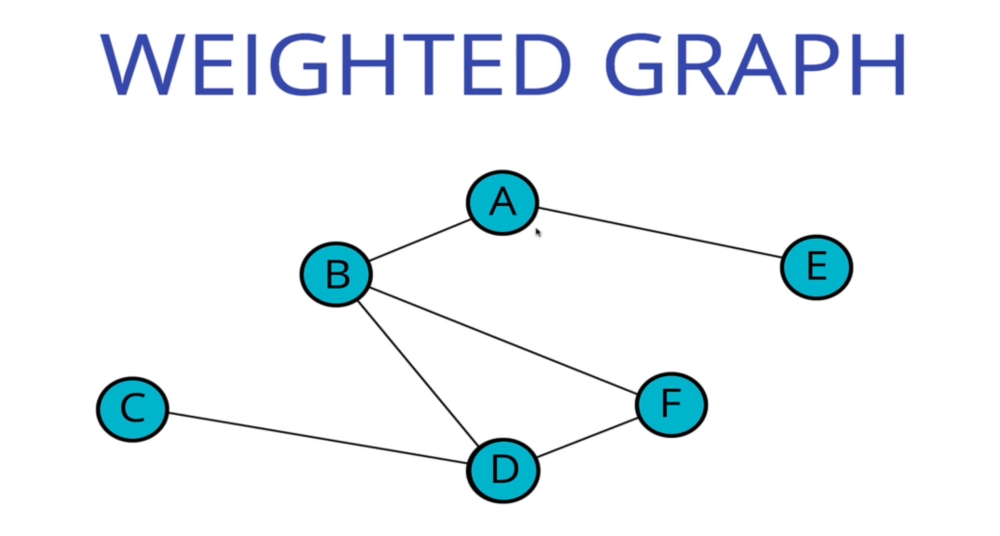
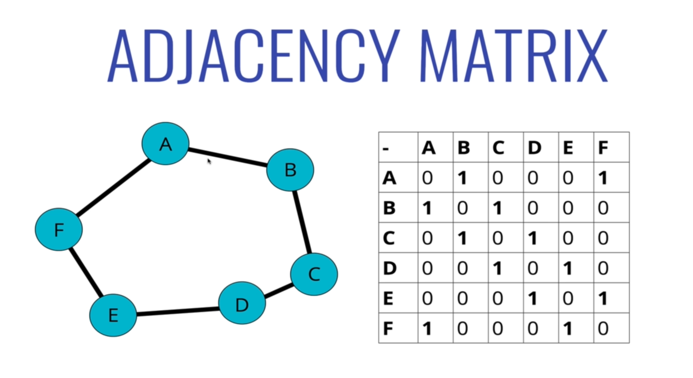
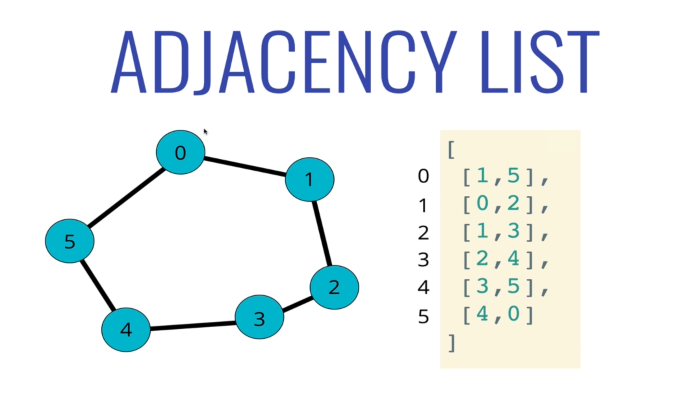
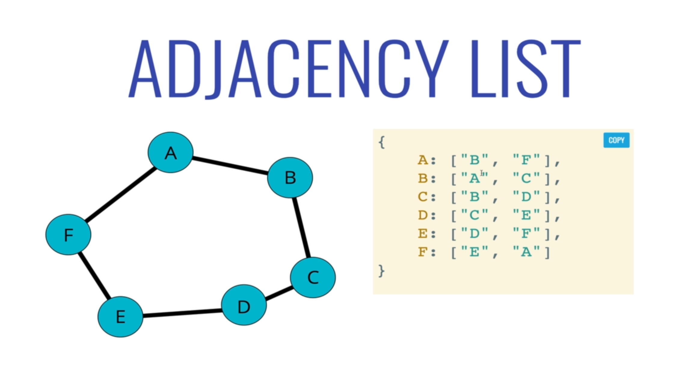
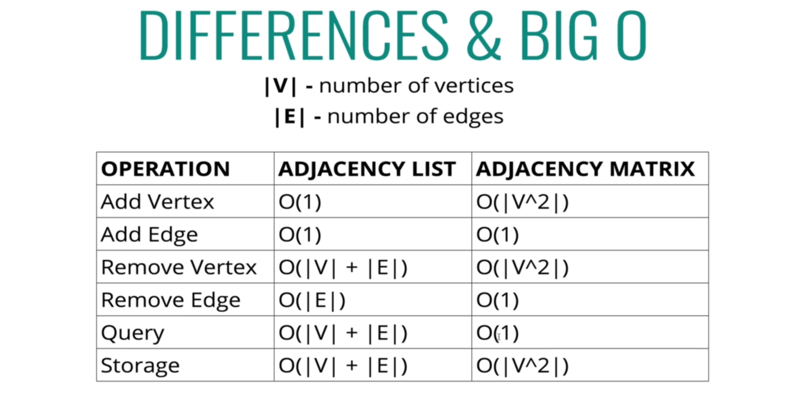
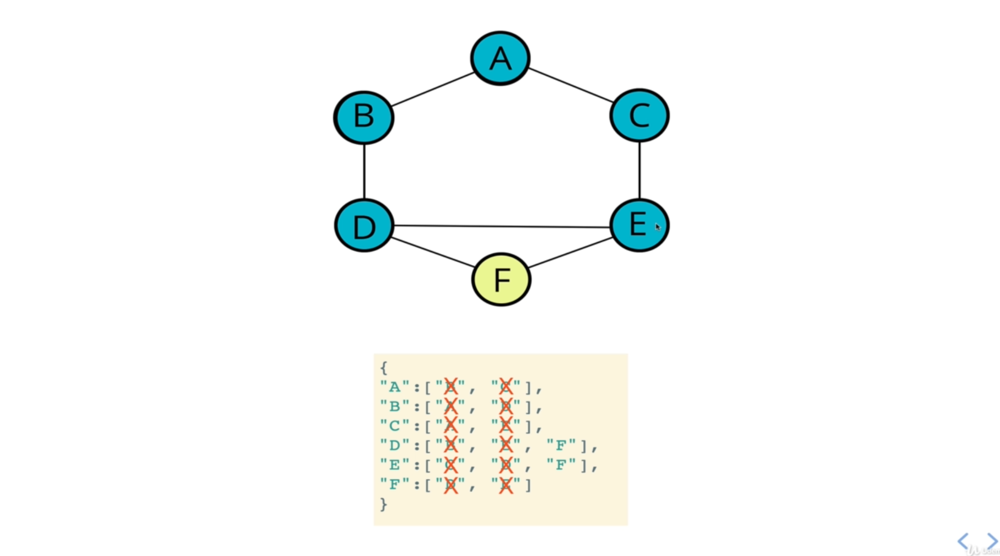

# Graphs

Graphs are a type of data structure that consists of a finite set of vertices, nodes, or points, a set of pairs of these vertices. The terminology vertices, nodes, and points are synonymous, and they can possibly be mutable in some cases. The connections between vertices are called _edges_.  Basically, a graph is a collection of nodes and a set of connections between these nodes.  The connections, i.e. a singular _edge_, are represented as a pair.

There are typically two types of graphs, and the order of the pairs of vertices matters for each.

- __Undirected Graph:__ The pair of vertices are unordered.
- __Directed Graph:__ The pair of vertices are ordered.

Terminology:

- __Vertex__ - a node
- __Edge__ - connection between nodes
- __Weighted / Unweighted__ - values assigned to distances between vertices
- __Directed / Undirected__ - directions assigned to distances between vertices
- __Neighbor__ - a node that directly relates to a reference node with only one edge, i.e. the closest node(s)

```js
// Directed Graph
A->B<->C
// nodes: [A,B,C]
// edges [[A,B], [B,C], [C,B]] order matters

// Undirected Graph
A---B  E
| / |
C---D
// nodes: [A,B,C,D,E]
// edges [[A,B], [A,C], [B,C], [D,B], [C,D]] order doesn't matter
```

## Where Are Graphs Used?

Graphs are pretty much used everywhere.

- Social networks
- Recommendation engines
- Finding the shortest path between given points (cities, flights, etc), location mapping
- Advertisement targeting
- Visual Hierarchy
- File System Optimizations
- Routing Algorithms

## Types of Graphs

### Undirected Graph

Edges are not one way, they are two-way.  Each vertex on either end of an edge in this type of graph can interact with each other.  Facebook Friends is a good example, each friend can view each other's content.



### Directed Graph

Often represented with arrows, each edge follows a given direction, and cannot be traveres in reverse.  They are one-way.  Instagram is a good example, followers can view following content, but that account won't be able to view their followers' content without following them.  Instagram uses a combination of bi-directional edges and uni-directional edges.



### Weighted Graph

A weighted graph applies priorities for each edge.  Each edge has a "weight" to them, or a value assigned to them.  The value can be important when deciding solutions to say, quickest route by distance from point A to B, or shortest bus rides by time. Google Maps may use a undirected weighted graph when determining shortest routes by time.  A flight map could use a directed graph with flight times, flying from one airport to another, and may not be bi-directional.  Think of finding the right flights to take to make the quickest trip from one city to another.



### Graphs vs Trees

Tress _are_ a type of graph, but a different type.  Every vertex is connected by _exactly_ one path.  A tree is essentially an unweighted, undirected graph where each node has up two two edges (in a binary tree).

## Representing a Graph

How can we represent a graph in code?  The important information to represent is the nodes and the connections of these nodes, i.e. how they are correlated.  There are two things we can use: **adjacency matrix** and **adjacency list**.





This adjacency list is represented at a hashmap.  Each key is the vertex, and each value is an array of other vertices it is connected to.



### Big O Notation - Adjacency List vs Matrix



#### Adjacency List

Pros:

- Can take up less space (in sparse graphs)
- Faster to iterate over all edges

Cons:

- Can be slower to lookup specific edge

#### Adjacency Matrix

Pros:

- Faster to lookup specific edge
Cons:
- Takes up more space (in sparse graphs)
- Slower to iterate over all edges

**We will implement an adjacency list.  See `/data-structures/Graph.js` for our implementation.**

Why? Most data in the real-world tends to lend itself to sparser and/or larger graphs.  Most of the time, any given node will have only a handful of connections.  Some nodes may have many, but more often than not, there are more nodes with few edges than there are nodes with many edges.  In this context, an **adjacency list** is preferred, since it will be faster to work with and take up less space.

## Traversing a Graph

You can traverse over a graph using two common searching algorithms that we've seen before, breadth-first search (BFS) and depth-first search (DFS).

### Graph Traversal Uses

- Peer-to-peer networking
- Web Crawlers
- Finding "closest" matches/recommendations
- Shortest path problems
  - GPS navigation
  - Solving mazes
  - AI (shortest path to win the game)

### Depth-First Traversal in Graphs

Depth-First traversal can be done in a couple of ways, both iteratively and recursively. DFT, in general tree, visits a nodes children before visiting its siblings, moving away from the root.  But in a graph, there is no general "from root down" direction.  To apply DFT, we will visit a node, then follow one singular edge through from that node, keep track that we visited it, and continue onto the next node and a singular edge from there.  We will pick the next node based off of some kind of ordering (alphabetically, etc.), and continue to visit nodes one by one, keeping track that we visited it.  We will use our adjacency list to help keep track of these visits.  When we reach a case where we hit a node, but all neighbor nodes have already been visited (i.e. a dead end), we will go one step back to the neighbor we left, and visit another edge from that previous node.

In short, we visit neighbors, and continue to follow neighbors before backtracking.

For the below example, we visit `A -> B -> D -> E -> [C] -> E -> F`, where `C` became a dead end.  We chose the next node based off of alphanumeric value, and because `C` comes before `F`, we visit it, but find out all neighbor nodes have already been visited `A & E`. We backtrack to `E` and choose the next alphanumeric node that hasn't been visited, `F`.  We visit it, and thus, visit all nodes in the graph.



### Breadth-First Traversal in Graphs

Depth-First traversal can be done in a couple of ways, both iteratively and recursively. BFT, in general tree, visits a nodes siblings before visiting its children, moving away from the root.  But in a graph, we will visit a node's neighbors _first_ before moving onto further edges from given node.  Once we visit all neighbors of a given node, we move onto those visited nodes and repeat the process for each.  Each time we move on, we move in `height`.  Height is similar to levels in binary search trees, and in a graph, it can be synonymous with `X jumps` from a given node.  A node's direct neighbors are a height of `1`, or one jump away, and the neighbors of those neighbors are a height of `2`, or two jumps.  We will need to keep track of visited nodes, just as we do in DFS.

In the above example, starting from `A`, we would visit nodes in the following order: `A -> B -> C -> D -> E -> F`.  That is because we visit `A`'s neighbors first, in a given order (alphanumerically in this case), which would be `B` then `C`. Then we visit `B`'s neighbors next, which is only `D`. Then `C'`s neighbors next, before moving onto the next height.  The process repeats until we've visited all nodes.  We check if the node is visited with each time before visiting it.  So we will get all neighbors, check if they're visited prior, and visit them if not.
