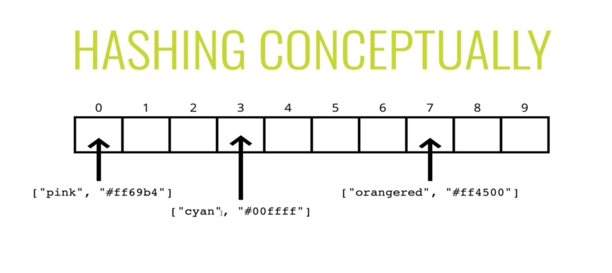
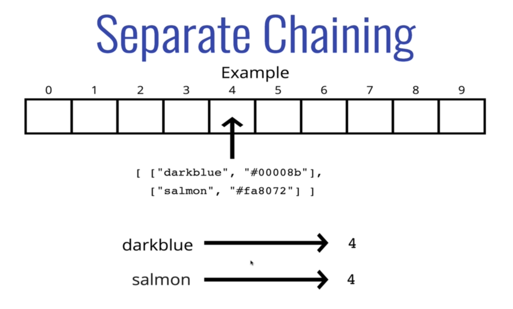
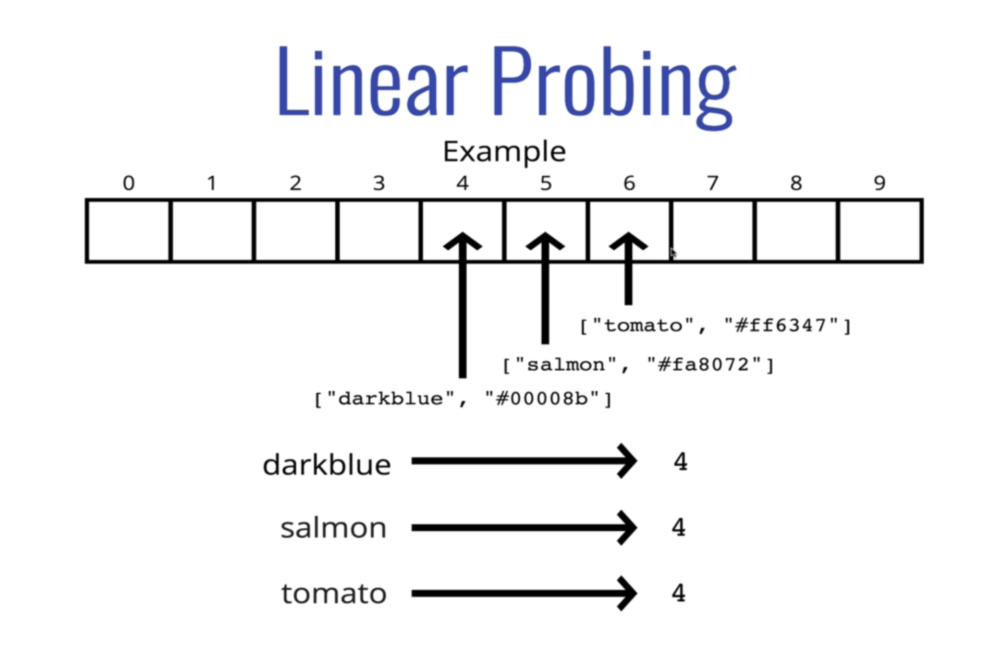

# Hash Tables

Hash tables are an extremely common data structure and is implemented in pretty much every programming language.  They are also known as hash maps.  They are a collection of key-value pairs.  We will end up creating our own hashing algorithm to understand the underlying techniques for a hash table.  Most often though in the real world, we will end up using a programming API for it.

Hash tables are _like_ arrays, but the keys are not ordered.  Unlike arrays, hash tables are _fast_ for all of the following operations: finding values, adding new values, and removing values.  This is one of the best reasons to implement hash tables in programming.

## Programming APIs

- JavaScript has `Map`, `WeakMap`, and `Object`
- Python has `Dictionary`
- C# has `Hashmap`
- Java, Go, and Scala have `Map`
- Ruby has `Hash`

## Implementing a Hash Table

Let's pretend these APIs don't exist.  We will devise our own version of a key-value pair hash table.  We could just use an array or list to represent our table.

Keys make accessing items much simpler.  For example, if we want to store the hexadecimal color `#ff0000` in an array of many `colors`, it could be hard to know what we're accessing.  `colors['#ff0000']` isn't as nice as `colors['red']` or even `colors.red`.  We can give the hexadecimal value a human-readable key name so that we may reference it more easily.  The key name would be `'red'`, and this is much easier to read.

How can we get human-readability _and_ computer readability?  Computers don't know how to find an element at index _pink_?

We can use an array to help implement a hash table.  In order to look up values by key, we need a way to convert keys into valid array indicies, i.e. a _hashing algorithm_ or _hash function_.



### Hashing Functions

A hashing function at its core is a function that converts a piece of data, whether it be objects, strings, numbers, etc., and converts it down into a fixed-length number, or hash.  This hash is essentially irreversible back to the original data.  The data can be any length or size in bytes, but the hashing function will always return the same fixed-length amount of bytes in the hash.  If the data changes by only one character, the hash itself will be drastically different.  If the data is the same, the hash will always be the same.

For example:

```js
hash('hello') // 32903290342390
hash('Hello') // 60958317305728
hash('a')     // 16687135944543
hash('hello') // 32903290342390 <- same data, same hash
```

There are many different types of hash functions, SHA256 for example.  Each hash function returns their own type of hash.  These could be numerical only, alphanumerical, 8 bytes, 256 bytes, etc.

Some hashes can include a signature to them, which would be its private key.  This secret key can be used to decrypt the hash back into its original data.  This falls under the world of cryptographic hash functions, which are commonly used for security purposed, even blockchain.

### What makes a good hash function (not a cryptographically secure one)?

- Fast (i.e. constant time)
- Doesn't cluster outputs at specific indicies, but distributes them uniformally
- Deterministic (same input yields same output)

Bad examples

```js
// slow
function slowHash(key) {
 for (let i = 0; i < 10000; i++) {
  console.log('everyday I am hashing')
 }
 return key[0].charCodeAt[0]
}

// clustering
function sameHashedValue(key) {
 return 0
}

// non-deterministic
function randomHash(key) {
 return Math.floor(Math.random() * 1000)
}
```

Good example (supports strings only)

```js
function goodHash(key, arrLen) {
 let total = 0
 for (let char of key) {
  // map "a" to 1, "b" to 2, "c" to 3, etc. using the utf8 char codes for each character
 // "a",charCodeAt(0) = 97
 let value = char.charCodeAt(0) - 96
 total = (total + value) % arrLen
 }
 return total
}
```

See `/snippets/hash.js` for this example and more.

### Use of Prime Numbers

The prime number in the hash is helpful in spreading out the keys more uniformly.  It's also helpful if the array that you're putting values into has a prime length.  Using prime numbers in this way result in way less collisions occurring when trying to store the data within the table.

Resources:

- [Why should hash functions use a prime number modulus?](https://stackoverflow.com/questions/1145217/why-should-hash-functions-use-a-prime-number-modulus)
- [Why should the length of your hash table be a prime number?](https://medium.com/swlh/why-should-the-length-of-your-hash-table-be-a-prime-number-760ec65a75d1)
- [Does making array size a prime number help in hash table implementation?](https://www.quora.com/Does-making-array-size-a-prime-number-help-in-hash-table-implementation-Why)

## How do we handle collisions?

Sometimes when we hash out some data and it results in the same index that another piece of data hashed out to, we will need to have a mechanism set up to handle these collisions and store them in different places.

In our examples of `hashSimple` and `hashBetter`, we have many collisions, because we have a small hash table length of `10` and a bad hash function.

Event with a large array and a great hash function, collisions are inevitable.  There are many ways to deal with collisions, but we will focus on two:

1. Separate chaining
2. Linear probing

### Separate Chaining

With _separate chaining_, at each index in our array, we store multiple values using a more sophisticated data structure (e.g. an array or a linked list).  This allows us to store multiple key-value pairs at the same position.  When performing lookups, we'll find the index, then loop through the array to find the right key-value pair needed.



### Linear Probing

With _linear probing_, we only store one value at each position, but when we find a collision, we search through the array to find the next empty slot and store it there.  Each key-value pair will have one index, and each index will have one key-value pair.



For an example of a hash table implementation using separate chaining, see `/data-structures/HashTable.js`.

## Big O of Hash Tables

Average Cases:

- Insertion: `O(1)`
- Deletion: `O(1)`
- Access: `O(1)`

Accessing is in the context of a key.  If searching for a value, then we'll have to check over every key, and that would be `O(n)` time.

This all comes down to how good the hash function, i.e. how fast it is and how well it reduces collisions.  In contrast, if there is a really bad hash function that distributes everything into one index, then the times become `O(n)`, since to manage the collision, it will need to loop through all items it has added thus far to find the right key-value pair.

## Recap

- Hash tables are collections of key-value pairs
- Hash tables can find values quickly given a key
- Hash tables can add new key-values quickly
- Hash tables store data in a large array, and work by _hashing_ the keys
- A good hash should be fast, distribute keys uniformly, and be deterministic
- Separate chaining and linear probing are two strategies used to deal with two keys that hash to the same index
