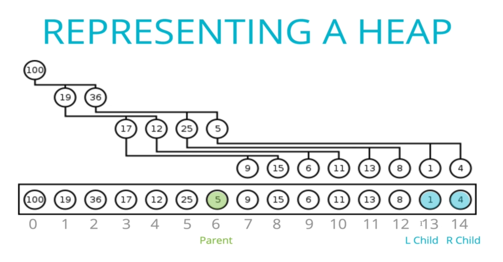

# Heaps

Heaps are a type of tree data structure. All the rules that apply to general tree also apply to heaps. There are many different types of heaps, but we are going to focus mainly on binary heaps.

## Binary Heaps

A binary heap is a type of heap that is very similar to a binary tree structure, but it has different rules. Each node can only have two child nodes at most. However, order of what is left and right does not matter, unlike a BST. There are two primary types of binary heaps:

- MaxBinaryHeap: In a MaxBinaryHeap, parent nodes are always larger than child nodes.
- MinBinaryHeap: In a MinBinaryHeap, parent nodes are always smaller than child nodes.

### Why do we need to know this?

Binary heaps are used to implement Priority Queues, another data structure, which are __very__ commonly used. They are also used quite a bit with __graph traversal__ algorithms.

### MaxBinaryHeap

- Each parent has at most two child nodes
- The value of each parent node is __always__ greater than its child nodes
- In a max binary heap, the parent is greater than the children, but there are no guarantees between sibling nodes
- A binary heap is as compact as possible. All the children of each node are as full as they can be, and left children are filled out first.
- Every left and right is filled out first before moving down to the next level.
- The two largest children won't necessarily be at the first level deep off of the root.

```js
       83
     /    \
    81     31
   /  \    / \
  47  12  24  3
```

### Not a Binary Heap

These are the same numbers as our MaxBinaryHeap, but in a specified order. This is now a Binary Search Tree. The smaller values are on the left, larger on the right.

```js
       83
      /   \
    47     81
   /       /
  12      24
 /  \
3   31
```

### MinBinaryHeap

The only rule with a min binary heap is that the children are larger in value than the parent node.

```js
        3
      /    \
    18      31
   /  \    /  \
  81  27  39   81
```

## Implementing a Binary Heap

There are a few ways to represent a binary heap. We could do the same thing we do for binary search trees, with node classes, etc. We can also just use the built in List/Array data type in many programming languages. This is the easy way. For implementations, see `/data-structures/snippets/MaxBinaryHeap.js`.

### Storage

Theres an easy way to store a binary heap, with a **linked list** or an **array**.
We can store the values in an array, in order, starting from the head and adding the left, then right children. Then start with the left child and add the left and right children, then the right child and add the left and right children.  Repeat this for each subsequent child.  This would make it easy to traverse using this array.

What if we have a parent node and want to find its children? **The rule**: for any index of an array `n`, the left child is stored at `2n + 1` and the right child is stored at `2n + 2`.

What if we have a child node and want to find its parent? **The rule**: For any child at index `n`, its parent is at `Math.floor((n-1)/2)`.



### Adding to a MaxBinaryHeap

- Add to the end of the heap, knowing this likely isn't the final place for the value
- Bubble the value up to where it should be based on its value, higher values first with lower values as children
  - Compare the node to its parent, if larger than parent, swap them
  - If parent is larger than it, the node is at a proper position

### Removing from a MaxBinaryHeap

When removing a node from a MaxBinaryHeap, we are usually set to remove the largest value from the heap.  In a MaxBinaryHeap, it will be the head.  Removing from a MinBinaryHeap has the opposite rule, where we will usually remove the smallest value in the heap.  It will be the head as well in a MinBinaryHeap.

> "The procedure for deleting the root from the heap (effectively extracting the maximum element in a max-heap or the minimum element in a min-heap) and restoring the properties is called "down-heap" (also known as bubble-down, percolate-down, sift-down, trickle down, heapify-down, cascade-down, and extract-min/max)."
>
> -Wikipedia

- Remove the root
- Replace with the most recently added, which becomes root
- Adjust (sink down) that value to the appropriate place, swapping along the way
  - Compare with the largest child, if the child node is larger, swap them (max heap)
  - If both children are smaller, it found a proper position in the heap (max heap)
